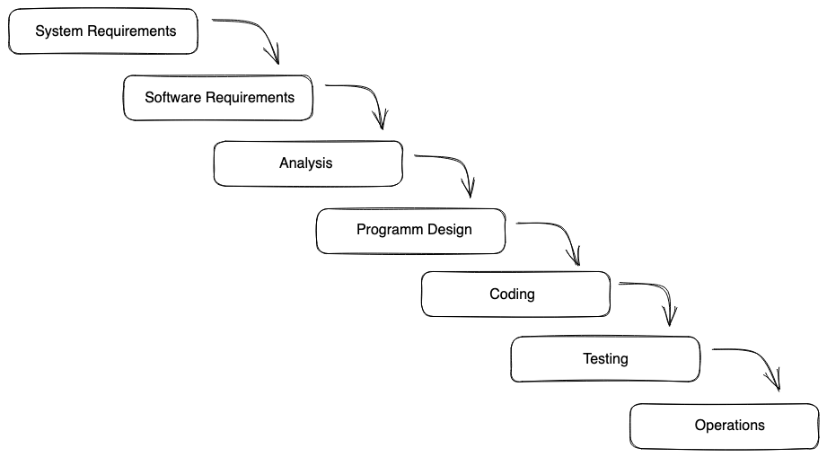
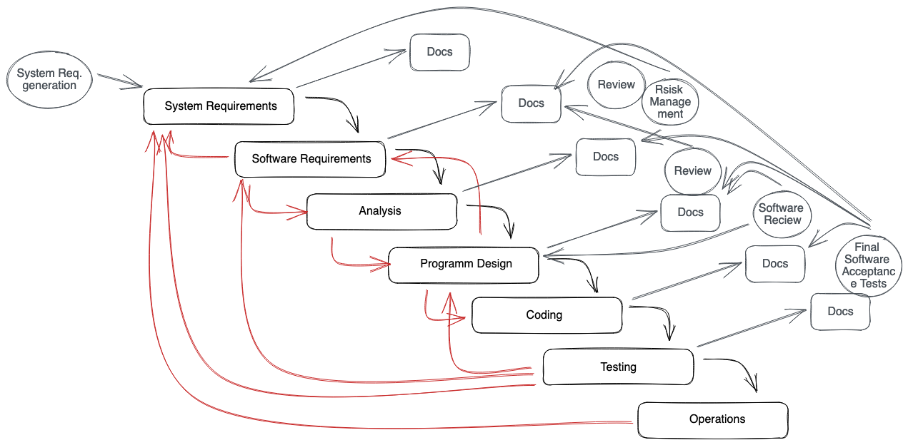

## SCRUM Intro

> ❗️ If students already had the **external agile workshop** make this a very short recap. Is there no **external agile workshop** talk about this topics in detail.

### Classic waterfall model

> This is a classic model, to develop products in projects. In software we need to adapt these models to agile methods.

- [ ] classic non-agile projects usually follow this method.
- [ ] Instead of an iterative planning and execution process, the whole product is planned in advance. Only after that the code is written.
- [ ] Reacting to unforeseen changes is almost impossible or very cost intensive, since a great part of the product has to be reworked.

- [ ] Usually there are a lot of dependencies between the phases and changes are hard do compensate.
- [ ] There is a lot of documentation.
- [ ] Once the project has started, every change is expensive and delays the project.
- [ ] We can not (or not quite so easily) react to the customer or other external influences.

### What is agile?

- [ ] explain what agile is
- [ ] the word agile can mean
  - a process in development of a product
  - a structure within a group or
  - the whole culture of a company
- [ ] agile development makes sure, that code is high quality and team is working as efficient as possible
- [ ] agile lets us react to changes super quickly and with a low effort (cost)
- [ ] agile teams are self organized and every member has the same amount of responsibility
- [ ] agile development teams are not only software developers, but also e.g. designers, technicians, texter etc.

#### "we are agile"

- explain what do people mean by that?
- [ ] the team / company uses one (or more) agile methods
- [ ] we are approaching new things step by step - iteratively
  - one iteration is short
  - after one iteration we gain feedback and check if the result is good, the process is good and if we need to change anything
  - if we need to change things - we do it right away
- [ ] therefore there is no / little fear to fail since its "cheap" to fail
- [ ] we develop new things quickly and can try them out
- [ ] at the end of every iteration there is a working product.

### SCRUM

- [ ] Walk though the SCRUM process with the Students.

> We will use most of the elements in our capstone.
> If students already had the external agile workshop, the following topic is RECAP:
> Ask students to explain what they remember.

The process of SCRUM has many components.

- [ ] The heart of this method is the **Sprint**.
  - The Scrum team, works on a defined list of tasks (**Sprint Backlog**) for a defined amount of time (1-4 weeks)
- [ ] Everyday we have a **daily standup** within the team where everybody shares her/his progress.
- [ ] There are more events during the week for the team, like **Sprint panning** (we plan what to put in the next Sprint) and **Sprint review** (after every sprint inform stakeholders about the Sprint results).
- [ ] After every Sprint there is a final **product increment**.
- [ ] The **Product Owner** keeps track of the progress and owns the product backlog.
- [ ] The **scrum master** is usually not part of the development team. Her/his goal is to make the team as efficient as possible, she/he checks if we can optimize the process, if the mood in the team is up and everybody can focus.
- [ ] **Retrospective** - where the team develops what went good, what went bad and what do we need to change for the next time. Depending on the team and project setup, it can be a sprint retro or one at the end of the project.

> We talk about backlogs and the tasks (user stories) later.

💡 Good to know:

- [ ] The goal of the scrum master is to make themself redundant. He/She should make the team as strong and independent as possible.
- [ ] Scrum methods can vary a lot from team to team. It depends on the company and how the team utilises the method.

> 💡 Here are some SCRUM advantages. Coaches may use it for a better understanding of the concept, not necessarily to discuss it in class.
>
> - The team can react to changes fast and easy.
> - It's transparent since there is no hierarchy, the team organizes itself.
> - It's quick to explain and easy to understand.
> - You have a working product faster compared to other methods.
> - The team is the focus, since it decides for itself. The customer is in the loop at all times and after every iteration changes are possible.
> - Scrum assures a high quality, since per iteration the code is already tested.
