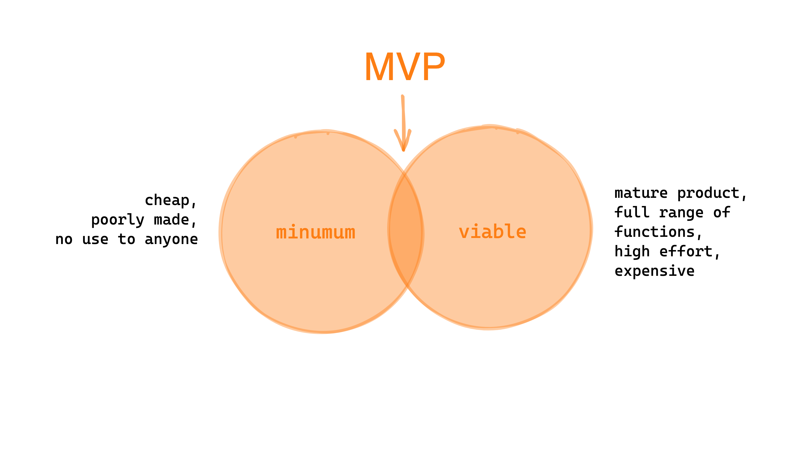

<!-- _class: big-headline nemo -->

Agile & Scrum

---

<!-- _class: big-headline granite -->

Classical Waterfall

---

<!-- _class: small  scrum-->

### Classic Waterfall Model

---

<!-- _class: small  scrum-->

### Classic Waterfall Model ...

---

<!-- _class: big-headline granite -->

What is **agile**?

---

<!-- _class: small -->

### What is **agile** ?

 

- **Agile** can mean process, structure and / or culture of a company

- **Agile** assures a high code quality and a team that is working efficiently

- **Agile** workflows prevents an overload of documentation and makes sure we are able to react fast to changes

- **Agile** teams are self-organized and interdisciplinary

---

<!-- _class: small -->

### We are agile !

 

➡️ Usage of agile methods.

➡️ Approaching new things step by step - iteratively.

➡️ No fear of failure - try new ways fast.

➡️ Always deliver a working product.

---

<!-- _class: small  scrum-->

### SCRUM

---

<!-- _class: big-headline granite -->

Backlog

---

<!-- _class: small  scrum-->

### Backlog

---

<!-- _class: small  scrum-->

### A developers week (example)

---

<!-- _class: big-headline granite -->

MVP

---

<!-- _class: small  scrum-->

### Minimal viable product - MVP

---

<!-- _class: small  scrum-->

### Minimal viable product - MVP

---

<!-- _class: big-headline granite -->

User Story

---

<!-- _class: small  scrum-->

### User Stories

---

<!-- _class: small  scrum-->

### How good are your user stories?

---

<!-- _class: small  scrum-->

### Write a full user story

---

<!-- _class: big-headline granite -->

Get started!

---

<!-- _class: intro-slide nemo -->

Inspect and adapt
