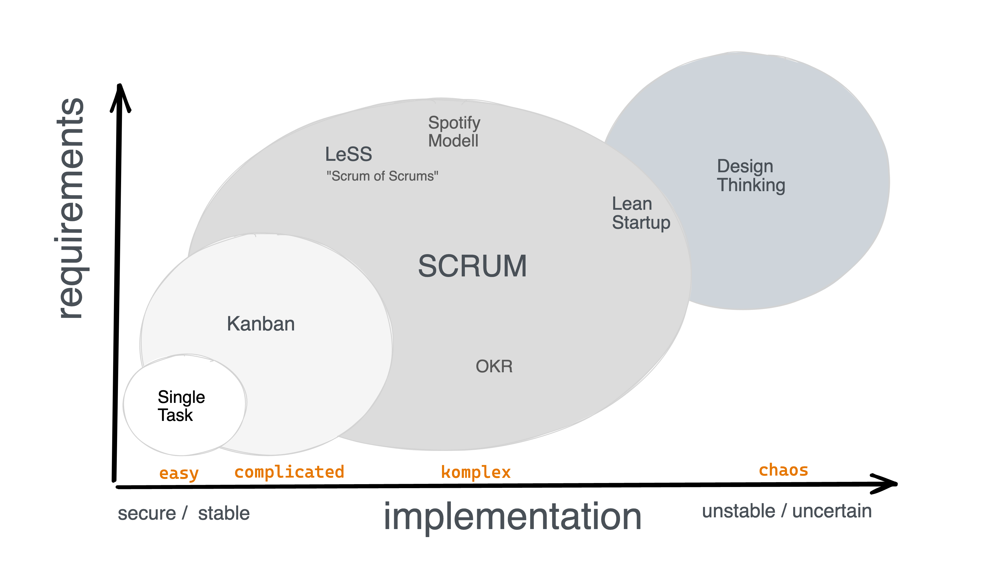
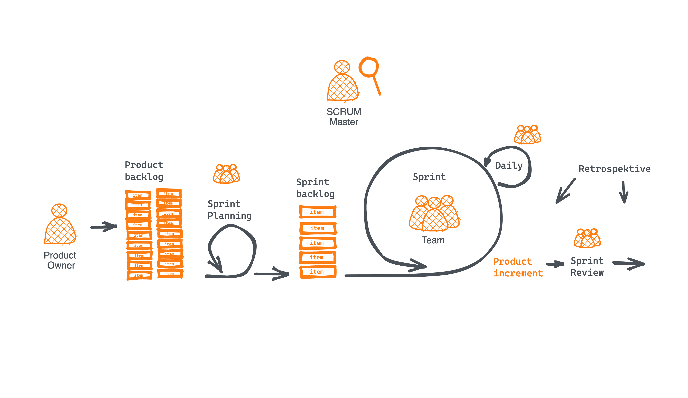
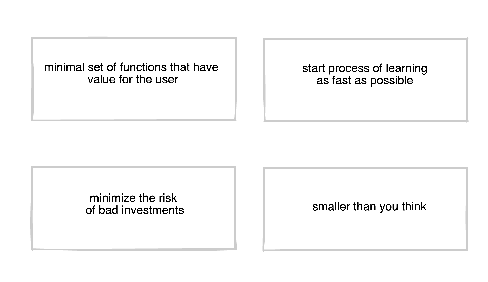
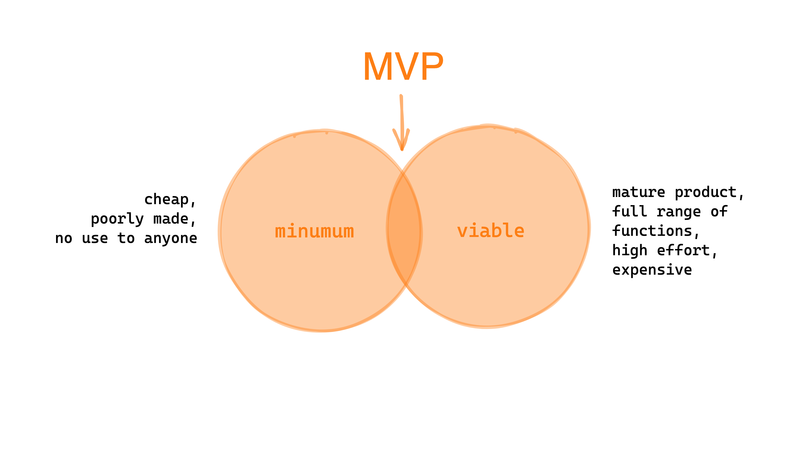
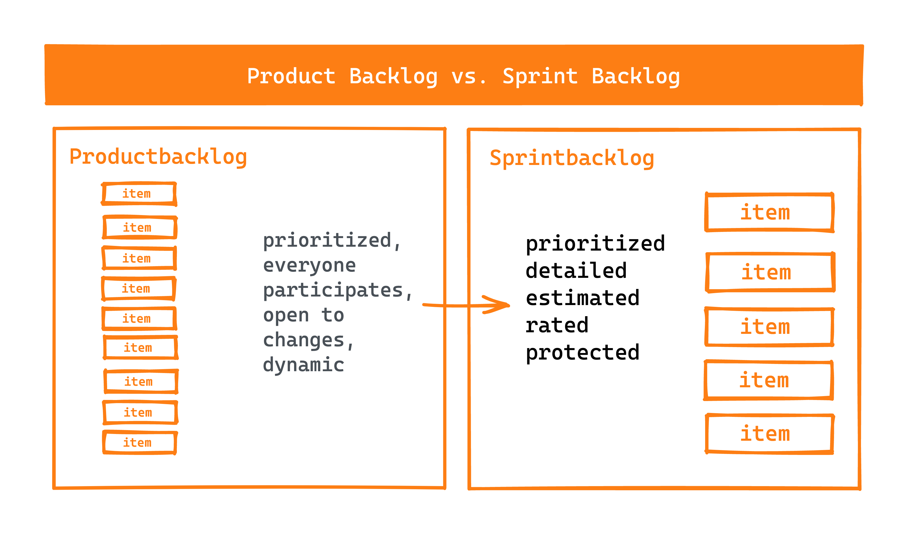

# Agile Workflow and User Stories

## Learning Objectives

- [ ] What is agile & SCRUM
- [ ] What is a MVP
- [ ] How to organize your Backlog
- [ ] What are the Scrum meetings
- [ ] How to write good user stories

---

## Agile

The word agile can mean a process in developing a product, a structure within a group or the whole culture of a company. It's about to do something (act) - check the results very quickly and adapt to the results of the iteration. Inspect and adapt. We develop in iterations, we continuously check and align the results and change the way we do it, to get the best results. The good thing is, that we can try and fail, we are free to change if things don't work out. At the end of every iteration is a working product.

There are a lot of different methods, we can use in agile management. The picture lists the most important methods in agile and shows their complexity and implementation.


Agile methods: complexity over implementation

- **Single Task**: One Person does a job without many dependencies to others. It's simple, straight forward and easy in implementation.
- **Kanban**: the tasks are defined and you work on it one by one. When a task is finished you pull the next one. The status of your task can be viewed on a board (Kanban board) from the other team members. By itself it is not complex, but complicated when used in a group.
- **SCRUM**: a complex method in agile, with different roles, phases and events for the team members.
- **LeSS** : Large Scale Scrum / "Scrum of Scrums". Scaled Scrum for larger teams that work on the same product, has similar but adopted process and events.
- **OKR**: Objective Key Results. Is a management method that works out goals for the team and iteratively check on the goals and change them if needed.
- **Spotify model**: Spotify developed a model that works agile and scrum-like for huge teams that work for the same product.
- **Lean Start up**: Is a concept to very lean build - measure and learn about your new product
- **Design Thinking**: Is an agile method to find ideas and solve problems. The idea is that people from different disciplines work in a creative environment to develop the question, the needs of a user, the concepts and test the results.

---

## SCRUM overview


SCRUM

The heart of the method is the **Sprint**. It's a fixed time where the developer team consistently works on defined tasks. Everyday there is a **daily standup** where everybody shares her/his progress. There are more events during the week for the team, like **Sprint planning** (we plan what to put in the next sprint) and **Sprint review** (after every Sprint inform stakeholders about the Sprint results).

After every Sprint there is a final **product increment**. The **product owner** keeps track and owns the product backlog, the **scrum master** is usually not part of the development team. Her/his goal is to make the team as efficient as possible, she/he checks if we can optimize the process, if the mood in the team is up and everybody can focus.

The **Retrospective** reveals what went well, what went bad and what do we need to change in preparation for the next time.

## MVP

**Minimal Viable Product**

Because the Agile methodology is built on validating and iterating products based on user input, the MVP plays a central role in agile development.



The MVP is an instrument for risk minimization in the course of product development.
It's a serviceable product with minimal features, created with little effort and used to obtain customer or user feedback



## Backlog

There are two backlogs to consider: Product backlog and Sprint backlog. Check the Sprint overview image again to tell the difference.

**Product Backlog**: The Product Owner owns the product backlog. There are items listed, that need to be considered during development of the product. It is prioritized, and contains user stories, anybody can contribute. The product owner keeps track and knows which items needs to be done soon. The priority and content is always open for changes.

**Sprint Backlog**: The Sprint backlog defines all user stories for the next sprint. The user stories are detailed and finished, prioritized and fixed. Once the Sprint has started, the Sprint backlog is protected and the development team focuses on those tasks.



## User Stories

**Goal**: Find a reason for the user why the feature is needed.

Defining an expected user value for our product, **user stories** allows us to define requirements and tasks to be followed by the team.

Value proposition

```
As an <actor> (User, Author, logged in User...)
I want a <feature>
So that <benefit>

```

To write good user stories, ensure that it fits certain criteria.
A good user story will follow the criteria termed as INVEST by Bill Wake.

I: Independent

User stories should be independent. You have to ensure that any changes to a user story do not affect another. This is to avoid increasing the work burden and an effort to keep user stories simple.

N: Negotiable

One of the main purposes of creating user stories is to give your team flexibility in their working process. Hence, the project team must be given free reign in the implementation of user stories

V: Valuable

A user story that fails to clearly state the value of the product to the user is essentially worthless. While creating user stories, you must make it understandable and also clearly state the value of the product.

E: Estimable

The development of the goals highlighted by the user story should be measurable. This will allow your team to determine their priorities as well as their working schedule.

S: Small

User stories need to be short. Stories that require multiple Sprints to be completed defeat the purpose of what a user story needs to achieve.

T: Testable

Finally, the user story needs to have an achievable goal that can be tested to see if it delivers on user expectations.

### User Story Template

```md
## Title

## Value proposition

As an <actor>
I want a <feature>
So that <benefit>

## Description

- Scribble / design or text
- Precise, no unnecessary information

## Acceptance criteria

- [ ] What happens when an entry is empty?
- [ ] How should something behave?
- [ ] What is the text of an alert?

## Tasks

- [ ] List the tasks that need to be performed within the dev team
```

---

## Resources

- [Agile methods](https://www.atlassian.com/de/agile)
- [Userstories](https://cucumber.io/docs/terms/user-story/)
