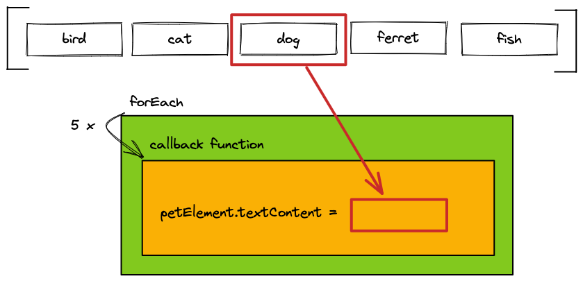

# JS Array Methods

## Learning Objectives

- Understanding array iteration with `forEach`
- Understanding array iteration with `map`
- Knowing the difference between `forEach` and `map`
- Using `filter` to exclude array elements
- Using `document.querySelectorAll`

---

## Introduction to array methods

All array methods presented here have a lot in common and can be used in the same way.

- You provide a callback function with one parameter
- The array method iterates over an array
- The provided callback function gets called for each element in the array
- With each call to the function the current array element gets passed as first argument

This way you can write code and apply it to each element within an array

---

## `forEach`

The array method `forEach` executes some logic for each element within an array.

```js
const pets = ["bird", "cat", "dog", "ferret", "fish"];
pets.forEach((pet) => {
  const petElement = document.createElement("p");
  petElement.textContent = pet;
  document.body.append(petElement);
});
```

> ❗️ The callback function provided to `forEach` **must not** use a `return` statement. `forEach` >
> **does not return** a new array.

> ❗️ You **should** use `forEach` to use a side-effect, like `document.createElement`



---

## `map`

The array method `map` is used to apply a transformation to each element of an array.

The transformed elements are stored in the **newly created array** returned by `map`. The elements
in the original array are not being altered.

You can define the kind of transformation applied to each element in the callback function and
**return** the transformed element.

The created and the original array have the same length.

```js
const pets = ["bird", "cat", "dog", "ferret", "fish"];
const uppercasePets = pets.map((pet) => {
  return pet.toUpperCase();
});
console.log(uppercasePets); // ['BIRD', 'CAT', 'DOG', 'FERRET', 'FISH']
```


> ❗️ The callback function provided to `map` **must** use a `return` statement to return a
> transformed element. `map` **returns** a new array.

> ❗️ You **should not** use `map` to trigger a side-effect, like `document.createElement`

---

## `filter`

The array method `filter` is used to **create a new array** with a subset of the elements of the
original array.

The callback function **returns** a **boolean value** to define, if an element is being included in
the resulting array or not. The original array is not being altered.

The created array is likely to have a shorter length than the original array.

```js
const pets = ["bird", "cat", "dog", "ferret", "fish"];
const petsWithF = pets.filter((pet) => {
  return pet.startsWith("f");
});
console.log(petsWithF); // ['ferret', 'fish']
```

> ❗️ The callback function provided to `filter` **must** use a `return` statement to return a
> boolean value.


---

## Chaining array methods

Often times you need to combine multiple array methods to achieve a desired result. Array methods
like `map` and `filter`, that return a new array, can be **chained**. Instead of storing each array
in a separated variable, the methods can be called directly after another. This reduces the amount
of code and improves readable.

```js
const pets = ["bird", "cat", "dog", "ferret", "fish"];
const uppercasePetsWithF = pets
  .filter((pet) => {
    return pet.startsWith("f");
  })
  .map((pet) => {
    return pet.toUpperCase();
  });
console.log(uppercasePetsWithF); // ['FERRET', 'FISH']
```

---

## `document.querySelectorAll`

With `document.querySelectorAll` you can select a list of elements from the DOM. This is in contrast
to `document.querySelector`, which provides only the first occurrence of an element matching the
selector.

```js
const pets = document.querySelectorAll('[data-js="pet"]');
console.log(pets.length); // 5
```

The `NodeList` returned by `document.querySelectorAll` is an array-like object. You can use the
`forEach` method to iterate over the DOM elements.

```js
const pets = document.querySelectorAll('[data-js="pet"]');
pets.forEach((pet) => {
  pet.addEventListener("click", () => {
    // [...]
  });
});
```

> ❗️ A `NodeList` is not an array! Other array methods like `map` or `filter` can't be used. If you
> need to use array methods, you can convert the `NodeList` to an array using `Array.from()`

---

## Resources

- [MDN web docs: Array forEach](https://developer.mozilla.org/en-US/docs/Web/JavaScript/Reference/Global_Objects/Array/forEach)
- [MDN web docs: Array map](https://developer.mozilla.org/en-US/docs/Web/JavaScript/Reference/Global_Objects/Array/map)
- [MDN web docs: Array filter](https://developer.mozilla.org/en-US/docs/Web/JavaScript/Reference/Global_Objects/Array/filter)
- [MDN web docs: NodeList](https://developer.mozilla.org/en-US/docs/Web/API/NodeList)
