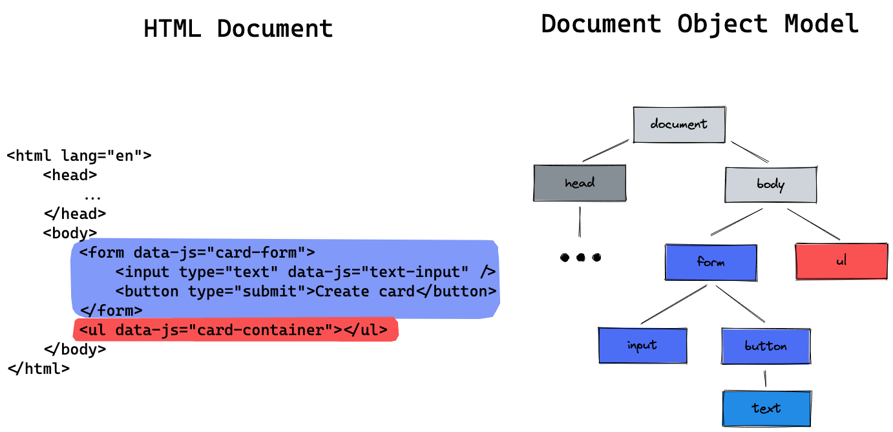

# JS createElement

## Learning Objectives

- knowing what the DOM is
- learning how to generate HTML in JavaScript
- using HTML element object properties and methods
- learning how to use `.innerHTML`

---

## The DOM

The **Document Object Model** is a representation of the HTML document. Each HTML Tag is modelled as
a **node** in a tree structure, which shows how HTML elements are nested. A computer program such as
your JavaScript file can access and manipulate the HTML website by changing the DOM via the
`document` object. 

## `document.createElement`

You can generate an HTML element with JavaScript by using the `document.createElement` method. It
expects the type of element as an argument.

```js
const article = document.createElement("article");
const button = document.createElement("button");
```

After generating an element, you need to place the element into the DOM. For this, you can use the
`.append` method. It places the element as the **last child** into the respective element.

```js
document.body.append(article); // placing the created article at the end of the body
article.append(button); // placing the created button into the article
```

The result looks like this:

```html
<body>
  ...
  <article>
    <button></button>
  </article>
</body>
```

---

## Element Properties and Methods

As well as with queried HTML elements (via `querySelector`), we can add classes, event listeners and
more to the created HTML elements.

```js
article.classList.add("card");

button.addEventListener("click", () => {
  console.log("It works!");
});
```

The text of an element can be changed by reassigning the `.textContent` property:

```js
button.textContent = "Click me!";
```

### Common Element Properties and Methods

| Property          | Effect                                                             |
| ----------------- | ------------------------------------------------------------------ |
| `classList`       | add, toggle or remove classes from element                         |
| `textContent`     | get or set text inside element                                     |
| `style`           | define inline style, e.g. `element.style.backgroundColor = "red" ` |
| `hidden`          | boolean whether element is hidden or not                           |
| `focus()`         | focusses the element on the website                                |
| `hasAttribute()`  | returns true if the element has the given attribute                |
| `querySelector()` | returns the first child that matches the given CSS selector        |

> 💡 You can assign HTML attributes by using the element properties. Go to the
> [MDN Docs](https://developer.mozilla.org/en-US/docs/Web/API/Element#properties) for a
> comprehensive list of element properties.

---

## `.innerHTML`

> ❗️ innerHTML can be unsafe when user input is passed into the template literal. Use it with
> caution. Read
> [this article](https://developer.mozilla.org/en-US/docs/Web/API/Element/innerHTML#replacing_the_contents_of_an_element)
> for more information about it.

The `innerHTML` property can be used to create the entire html layout of an element by passing the
html code as a string. By using **template literals** the content of the html can be dynamically
created.

```js
const cityName = "Lissabon";

article.innerHTML = `
	<h2> ${cityName} </h2>
	<p class="card__content">
		${cityName} is a very beautiful city in Portugal. 
		Go there and enjoy the stay!
	</p>
	<button type='button' class="card__booking-button"> 
		Book Trip 
	</button>
`;
```

This HTML code is rendered then **inside** the article element:

```html
<body>
  ...
  <article>
    <h2>Lissabon</h2>
    <p class="card__content">
      Lissabon is a very beautiful city in Portugal. Go there and enjoy the
      stay!
    </p>
    <button type="button" class="card__booking-button">Book Trip</button>
  </article>
</body>
```

### Resetting Element Content

`.innerHTML` can also be used to **reset** the content of an element, e.g. a container:

HTML before:

```html
<ul data-js="cardContainer">
  <li class="card">...</li>
  <li class="card">...</li>
  <li class="card">...</li>
</ul>
```

By setting the innerHTML to an empty string, the content is deleted:

```js
const cardContainer = document.querySelector('[data-js="cardContainer"]');
cardContainer.innerHTML = "";
```

The result:

```html
<ul data-js="cardContainer"></ul>
```

---

## Resources

### Element Properties

[MDN Docs about element Properties](https://developer.mozilla.org/en-US/docs/Web/API/Element#properties)

### innerHTML

[MDN Docs about securtiy risks with innerHTML](https://developer.mozilla.org/en-US/docs/Web/API/Element/innerHTML#replacing_the_contents_of_an_element)
