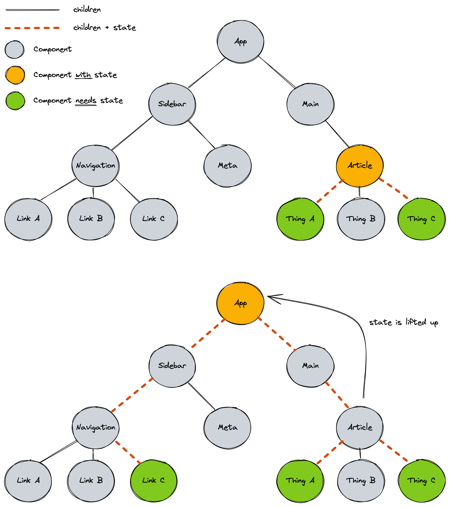

# React State 2

## Learning Objectives

- [ ] Knowing how to handle form fields: controlled components, uncontrolled components
- [ ] Knowing how to handle form submit events
- [ ] Understanding the concept of lifting state up
- [ ] Knowing how to pass state and functions via props
- [ ] Understanding that state updates are not synchronous
- [ ] Knowing what a `hook` in React is and which rules apply to hooks

---

## Sharing State Between Components

### Passing State Down

The value of a state variable and the setter function can be passed down to child components as
props. They are functions and values, so they can be passed down like any other data.

```js
function Parent() {
  const [count, setCount] = useState(0);

  function handleIncrement() {
    setCount(count + 1);
  }

  return <Child count={count} onIncrement={handleIncrement} />;
}
```

```js
function Child({ count, onIncrement }) {
  return (
    <>
      <p>Count: {count}</p>
      <button onClick={onIncrement}>increment</button>
    </>
  );
}
```

### Lifting State Up

When we have multiple components that need to share state, we can lift the state up to the parent
component and pass it down as props. This is called "lifting state up" because you usually start with
the state directly in the child component and then move it up to the parent components as you need
it in more and more components.

A state variable can be passed down to multiple child components. The child components can then
update the state variable by calling the setter function.

Any state variable should live as low in the component tree as possible but has high as needed. If
the whole `App` needs to know about the state variable, it should live in the `App` component. If
only child components of the `Article` need to know about the state variable, it should live in the
`Article` component.

Consider the following example:



Here we find that a `Link` in the `Navigation` component needs to know about a state that previously
existed in the `Article` component. We can lift the state up to the `App` component and pass it down
to the `Article` component as a prop.

> 📙 Read more about
> [**Sharing State Between Components** in the React docs](https://react.dev/learn/sharing-state-between-components).

## Handling Form Data

### Using Form Data `onSubmit`

We can use the `onSubmit` event handler to handle form data. The `onSubmit` event handler is called
when the user submits the form. We can get the form data (just like with regular JavaScript) from
the `event` object.

```js
function SearchForm() {
  function handleSubmit(event) {
    event.preventDefault();
    const form = event.target;
    const searchTerm = form.elements.searchTerm.value;
    console.log("A new search term was submitted:", searchTerm);
  }
  return (
    <form onSubmit={handleSubmit}>
      <label htmlFor="searchTerm">Search</label>
      <input name="searchTerm" id="searchTerm" />
      <button>Search</button>
    </form>
  );
}
```

In this example the input elements value is not manually controlled by React: The input is an
"uncontrolled input". It's value is managed by the browser. In the submit event handler we just
"peek" at the input field and read the value from the DOM.

### Using Controlled Inputs

We can use React to control the value of an input element. This is called a "controlled input". This
means that we manually set the value attribute of the input element. We can wire up a state variable
to the value attribute of the input element. This way the input element will always have the same
value as the state variable. Combined with the `onChange` event handler we can update the state
variable when the user types in the input field.

```js
function SearchForm() {
  const [searchTerm, setSearchTerm] = useState("");

  function handleSubmit() {
    event.preventDefault();
    console.log("A new search term was submitted:", searchTerm);
  }

  return (
    <form onSubmit={handleSubmit}>
      <label htmlFor="searchTerm">Search</label>
      <input
        name="searchTerm"
        id="searchTerm"
        value={searchTerm}
        onChange={(event) => setSearchTerm(event.target.value)}
      />
      <button>Search for {searchTerm}</button>
    </form>
  );
}
```

In this example you always know the value of the search term input. Since it is a state variable,
you can use it in other places in your application. You should prefer using uncontrolled inputs
when possible, but sometimes you need to use a controlled input.

You might need a controlled input when

- showing search results while the user is typing,
- autocompleting the user's input or
- validating the user's input.

## State Updates are not Immediate

When we call the setter function of a state variable, React will not immediately update the state
variable. Instead, it will update it's internal value and schedule a re-render of the component.

```js
// ⚠️ This code is broken!
function Counter() {
  const [count, setCount] = useState(0); // count is 0 initially

  function handleIncrement() {
    // when this is first called, count is still 0
    console.log(count); // → 0

    // this will set reacts internal state to 1,
    // but does not update the count variable
    setCount(count + 1);
    console.log(count); // → 0

    // the count variable is still 0, thus count + 1 is still 1,
    // so react's internal state will still be 1
    setCount(count + 1);
    console.log(count); // → 0

    // since setter functions were called
    // react will schedule a re-render of
    // the component with the new count value of 1
  }

  return (
    <>
      <p>Count: {count}</p>
      <button onClick={handleIncrement}>increment by 2</button>
    </>
  );
}
```

This behavior can be unexpected, but it is important to understand that state variables are not
immediately updated.

There are a few ways to fix the code above. In this example we could call `setCount(count + 2)` and
be done. If for some reason we need to call `setCount` twice, we can use the functional form of the
setter function, which provides the current internal value of the state variable as an argument.

```js
// ⚠️ This code is unnecessary complicated, but it works!
function Counter() {
  const [count, setCount] = useState(0); // count is 0 initially

  function handleIncrement() {
    // when this is first called, count is still 0
    console.log(count); // → 0

    // this will set reacts internal state to 1,
    // but does not update the count variable
    setCount((prevCount) => prevCount + 1);
    console.log(count); // → 0

    // the internal value of count is 1,
    // we get it as the the first parameter of the function we pass to the setter.
    // 1 + 1 is 2, so react's internal state will now be _2_
    setCount((prevCount) => prevCount + 1);
    console.log(count); // → 0

    // since setter functions were called
    // react will schedule a re-render of
    // the component with the new count value of _2_
  }

  return (
    <>
      <p>Count: {count}</p>
      <button onClick={handleIncrement}>increment by 2</button>
    </>
  );
}
```

> 💡 Here the prefix `prev` is used to indicate that the value is the previous value of the state
> variable. Another common convention is to use the just the first letter of the state variable as
> the parameter name: `setCount(c => c + 1)`.

> 📙 Read more about
> [**Updating state based on the previous state**](https://react.dev/apis/react/useState#updating-state-based-on-the-previous-state)
> and
> [**I’ve updated the state, but logging gives me the old value**](https://react.dev/apis/react/useState#ive-updated-the-state-but-logging-gives-me-the-old-value)
> in the React docs.

## React Hooks

The `useState` function is part of a broader set of features of react that give components extra
powers.

Hooks are functions that allow component functions to hook into React features (like state) and
allow components to do more than a traditional JavaScript function can. They follow the naming
convention `useXzy`.

Common hooks that you'll come across are `useState` and `useEffect`.

When using hooks you need to follow a few rules:

- Only call hooks at the top level. Don’t call Hooks inside loops, conditions, or nested functions.
- Only call hooks from React function components or custom hooks. Don’t call Hooks from regular
  JavaScript functions.

> 📙 Read more about [**Hooks** in the React Docs](https://reactjs.org/docs/hooks-overview.html)
> from when they were introduced to React.

---

## Resources

- [Sharing State Between Components in the React Docs](https://react.dev/learn/sharing-state-between-components)
- [Updating state based on the previous state in the React Docs](https://react.dev/reference/react/useState#updating-state-based-on-the-previous-state)
- [I’ve updated the state, but logging gives me the old value in the React Docs](https://react.dev/reference/react/useState#ive-updated-the-state-but-logging-gives-me-the-old-value)
- [Hooks at a Glance in the React Docs](https://reactjs.org/docs/hooks-overview.html)
